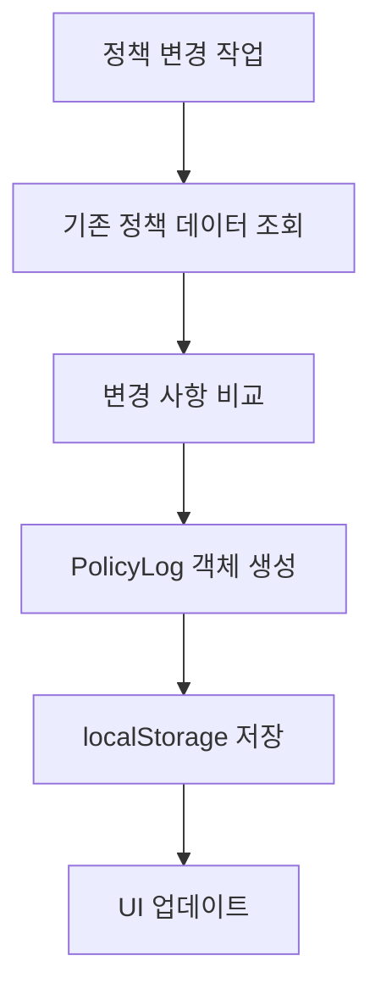
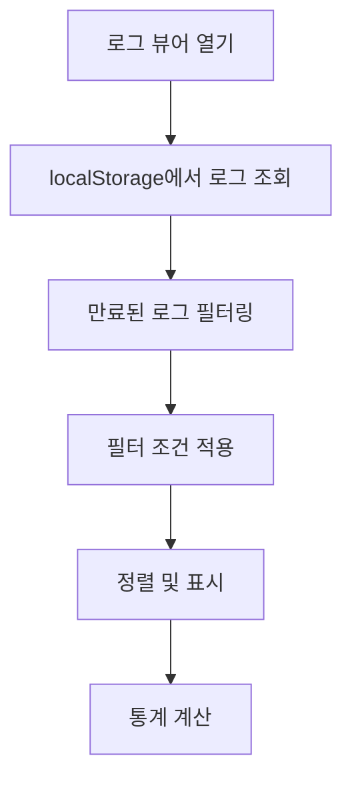

# 정책 로그 시스템 (Policy Log System)

## 개요

정책 관리 시스템에서 모든 정책 변경사항을 추적하고 감사하기 위한 종합적인 로깅 시스템입니다. 정책의 생성, 수정, 삭제 모든 작업에 대해 상세한 기록을 남기며, 변경 내용을 시각화하고 분석할 수 있는 인터페이스를 제공합니다.

## 주요 기능

### 1. 포괄적인 감사 추적
- **정책 생성**: 새로운 정책 추가 시 완전한 정보 기록
- **정책 수정**: 변경 전후 값 비교를 통한 상세한 변경 내용 추적
- **정책 삭제**: 삭제된 정책 정보와 삭제 사유 기록

### 2. 상세한 메타데이터 수집
- **사용자 정보**: 작업을 수행한 사용자 ID와 이름
- **시간 정보**: 정확한 타임스탬프 (ISO 8601 형식)
- **브라우저 정보**: 사용자 에이전트 정보
- **작업 맥락**: 변경/삭제 사유 등 추가 정보

### 3. 변경 내용 비교 분석
- **필드별 비교**: description, minAmount, maxAmount, requiredApprovers
- **배열 비교**: 결재자 목록 변경 사항 정확한 추적
- **JSON 직렬화**: 복잡한 데이터 구조의 안전한 저장

### 4. 사용자 친화적 로그 뷰어
- **필터링 기능**: 액션 타입, 날짜 범위별 검색
- **통계 대시보드**: 전체 로그 수, 액션별 카운트, 사용자 수
- **상세 보기**: 개별 로그의 완전한 정보 표시
- **CSV 내보내기**: 외부 분석을 위한 데이터 추출

## 시스템 아키텍처

### 파일 구조

```
src/
├── types/
│   └── policyLog.ts          # 타입 정의
├── utils/
│   └── policyLogUtils.ts     # 로그 관리 유틸리티
└── components/
    └── security/
        ├── PolicyManagement.tsx    # 메인 정책 관리 (로그 통합)
        └── PolicyLogViewer.tsx     # 로그 뷰어 컴포넌트
```

### 핵심 타입 정의

```typescript
export interface PolicyLog {
  id: string;                    // 고유 로그 ID
  timestamp: string;             // ISO 8601 타임스탬프
  action: PolicyLogAction;       // CREATE | UPDATE | DELETE
  policyId: string;              // 대상 정책 ID
  policyDescription: string;     // 정책 설명
  userId: string;                // 작업 수행 사용자 ID
  userName: string;              // 작업 수행 사용자 이름
  changes: PolicyLogChange[];    // 변경 내용 배열
  metadata: PolicyLogMetadata;   // 추가 메타데이터
}

export interface PolicyLogChange {
  field: string;                 // 변경된 필드명
  oldValue: any;                 // 변경 전 값
  newValue: any;                 // 변경 후 값
}
```

## 데이터 흐름

### 1. 로그 생성 과정



### 2. 로그 조회 과정



## 저장소 관리

### localStorage 구조
- **키**: `custody_policy_logs`
- **형식**: JSON 배열
- **최대 크기**: 1000개 로그
- **보관 기간**: 90일

### 자동 정리
- 90일 초과 로그 자동 삭제
- 최대 로그 수 초과 시 오래된 로그부터 제거
- 조회 시마다 정리 작업 수행

## 보안 고려사항

### 데이터 무결성
- 로그 생성 시 모든 필수 필드 검증
- JSON 직렬화를 통한 안전한 데이터 저장
- 오류 발생 시 console.error 로깅

### 사용자 추적
- 현재 인증된 사용자 정보 기록
- 브라우저 정보 수집 (User-Agent)
- 작업 맥락 정보 보존

### 접근 제어
- 로그는 읽기 전용으로 표시
- 관리자 권한 확인 (추후 구현 예정)
- 로그 삭제는 특별한 권한 필요

## 성능 최적화

### 효율적인 저장
- 증분 저장: 새 로그만 추가
- 배치 작업: 여러 로그 동시 처리
- 압축: 불필요한 데이터 제거

### 빠른 조회
- 메모리 캐싱: 자주 사용되는 로그
- 인덱싱: 날짜별, 액션별 빠른 검색
- 페이지네이션: 대량 데이터 처리

## 사용법

### 1. 정책 변경 시 자동 로깅

```typescript
// 정책 수정 시
const changes = comparePolicy(oldPolicy, newPolicy);
if (changes.length > 0) {
  const log = createPolicyLog(
    'UPDATE',
    policyId,
    policy.description,
    currentUser.id,
    currentUser.name,
    changes
  );
  savePolicyLog(log);
}
```

### 2. 로그 뷰어 열기

```typescript
// 변경 이력 버튼 클릭
<button onClick={() => setShowLogViewer(true)}>
  변경 이력
</button>

// 로그 뷰어 컴포넌트
<PolicyLogViewer
  isOpen={showLogViewer}
  onClose={() => setShowLogViewer(false)}
/>
```

### 3. 로그 필터링 및 조회

```typescript
// 특정 조건으로 로그 조회
const filteredLogs = getFilteredPolicyLogs({
  action: 'UPDATE',
  startDate: '2024-01-01',
  endDate: '2024-12-31'
});

// 통계 정보 조회
const summary = getPolicyLogSummary();
```

## 확장 계획

### 단기 계획
- **실시간 알림**: 정책 변경 시 관련 사용자에게 알림
- **롤백 기능**: 이전 버전으로 정책 복원
- **고급 필터**: 사용자별, 정책별 세부 필터링

### 중기 계획
- **서버 동기화**: 백엔드 API와 연동
- **감사 보고서**: 정기적인 감사 리포트 생성
- **권한 관리**: 역할 기반 접근 제어

### 장기 계획
- **AI 분석**: 패턴 분석을 통한 이상 행위 탐지
- **규정 준수**: 금융 규제 요구사항 대응
- **다국어 지원**: 글로벌 운영을 위한 현지화

## 문제 해결

### 일반적인 문제

1. **로그가 표시되지 않음**
   - localStorage 지원 여부 확인
   - 브라우저 개발자 도구에서 저장소 확인
   - 로그 보관 기간 확인 (90일)

2. **변경사항이 기록되지 않음**
   - comparePolicy 함수 동작 확인
   - 사용자 인증 상태 확인
   - 콘솔 오류 메시지 확인

3. **성능 문제**
   - 로그 개수 확인 (최대 1000개)
   - 브라우저 메모리 사용량 확인
   - 필터링 조건 최적화

### 디버깅 도구

```typescript
// 로그 상태 확인
console.log('Total logs:', getPolicyLogs().length);
console.log('Log summary:', getPolicyLogSummary());

// 특정 정책 로그 확인
console.log('Policy logs:', getPolicyLogsByPolicyId(policyId));
```

## 결론

정책 로그 시스템은 금융 서비스의 규정 준수와 보안 요구사항을 충족하기 위한 필수적인 기능입니다. 모든 정책 변경사항을 투명하게 추적하고, 사용자 친화적인 인터페이스를 통해 감사 작업을 효율화합니다.

이 시스템을 통해 조직은 정책 변경에 대한 완전한 가시성을 확보하고, 규정 준수 요구사항을 만족하며, 보안 사고 발생 시 신속한 원인 분석이 가능합니다.